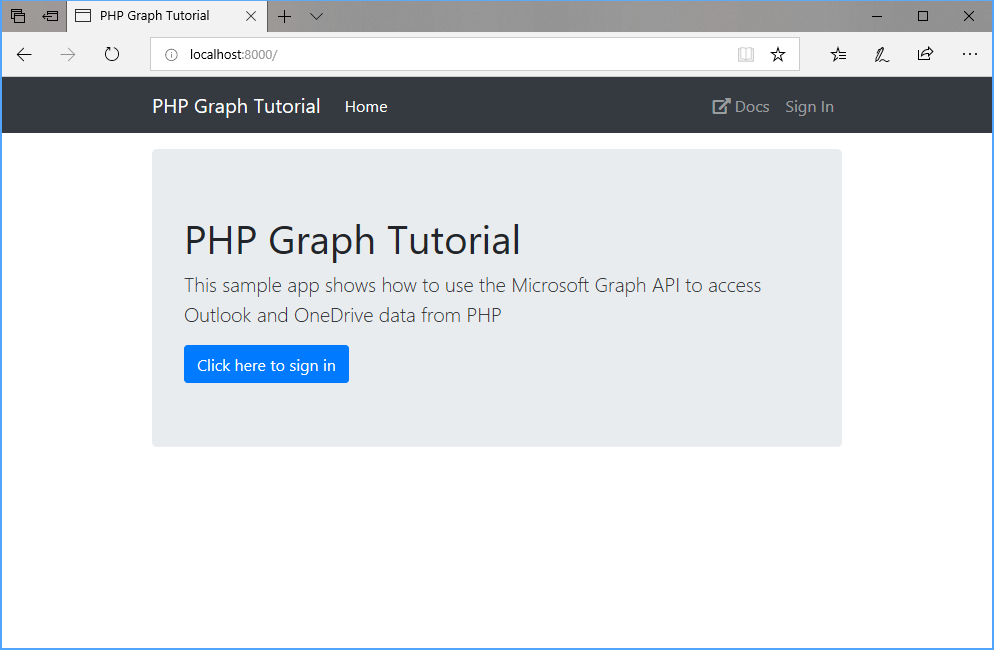

<!-- markdownlint-disable MD002 MD041 -->

<span data-ttu-id="879a1-101">Comece criando um novo projeto do Laravel.</span><span class="sxs-lookup"><span data-stu-id="879a1-101">Begin by creating a new Laravel project.</span></span>

1. <span data-ttu-id="879a1-102">Abra a interface de linha de comando (CLI), navegue até um diretório onde você tem direitos para criar arquivos e execute o seguinte comando para criar um novo aplicativo PHP.</span><span class="sxs-lookup"><span data-stu-id="879a1-102">Open your command-line interface (CLI), navigate to a directory where you have rights to create files, and run the following command to create a new PHP app.</span></span>

    ```Shell
    laravel new graph-tutorial
    ```

1. <span data-ttu-id="879a1-103">Navegue até o diretório do **tutorial do gráfico** e digite o seguinte comando para iniciar um servidor Web local.</span><span class="sxs-lookup"><span data-stu-id="879a1-103">Navigate to the **graph-tutorial** directory and enter the following command to start a local web server.</span></span>

    ```Shell
    php artisan serve
    ```

1. <span data-ttu-id="879a1-104">Abra o navegador e vá até `http://localhost:8000`.</span><span class="sxs-lookup"><span data-stu-id="879a1-104">Open your browser and navigate to `http://localhost:8000`.</span></span> <span data-ttu-id="879a1-105">Se tudo estiver funcionando, você verá uma página padrão do Laravel.</span><span class="sxs-lookup"><span data-stu-id="879a1-105">If everything is working, you will see a default Laravel page.</span></span> <span data-ttu-id="879a1-106">Se você não vir essa página, verifique os [documentos do Laravel](https://laravel.com/docs/7.x).</span><span class="sxs-lookup"><span data-stu-id="879a1-106">If you don't see that page, check the [Laravel docs](https://laravel.com/docs/7.x).</span></span>

## <a name="install-packages"></a><span data-ttu-id="879a1-107">Instalar pacotes</span><span class="sxs-lookup"><span data-stu-id="879a1-107">Install packages</span></span>

<span data-ttu-id="879a1-108">Antes de prosseguir, instale alguns pacotes adicionais que serão usados posteriormente:</span><span class="sxs-lookup"><span data-stu-id="879a1-108">Before moving on, install some additional packages that you will use later:</span></span>

- <span data-ttu-id="879a1-109">[oauth2-Client](https://github.com/thephpleague/oauth2-client) para manipulação de entrada e fluxos de token OAuth.</span><span class="sxs-lookup"><span data-stu-id="879a1-109">[oauth2-client](https://github.com/thephpleague/oauth2-client) for handling sign-in and OAuth token flows.</span></span>
- <span data-ttu-id="879a1-110">[Microsoft-Graph](https://github.com/microsoftgraph/msgraph-sdk-php) para fazer chamadas para o Microsoft Graph.</span><span class="sxs-lookup"><span data-stu-id="879a1-110">[microsoft-graph](https://github.com/microsoftgraph/msgraph-sdk-php) for making calls to Microsoft Graph.</span></span>

1. <span data-ttu-id="879a1-111">Execute o seguinte comando em sua CLI.</span><span class="sxs-lookup"><span data-stu-id="879a1-111">Run the following command in your CLI.</span></span>

    ```Shell
    composer require league/oauth2-client microsoft/microsoft-graph
    ```

## <a name="design-the-app"></a><span data-ttu-id="879a1-112">Projetar o aplicativo</span><span class="sxs-lookup"><span data-stu-id="879a1-112">Design the app</span></span>

1. <span data-ttu-id="879a1-113">Crie um novo arquivo no diretório **./Resources/views** chamado `layout.blade.php` e adicione o código a seguir.</span><span class="sxs-lookup"><span data-stu-id="879a1-113">Create a new file in the **./resources/views** directory named `layout.blade.php` and add the following code.</span></span>

    :::code language="php" source="../demo/graph-tutorial/resources/views/layout.blade.php" id="LayoutSnippet":::

    <span data-ttu-id="879a1-114">Este código adiciona a [inicialização](http://getbootstrap.com/) para estilos simples e a [fonte incrível](https://fontawesome.com/) para alguns ícones simples.</span><span class="sxs-lookup"><span data-stu-id="879a1-114">This code adds [Bootstrap](http://getbootstrap.com/) for simple styling, and [Font Awesome](https://fontawesome.com/) for some simple icons.</span></span> <span data-ttu-id="879a1-115">Também define um layout global com uma barra de navegação.</span><span class="sxs-lookup"><span data-stu-id="879a1-115">It also defines a global layout with a nav bar.</span></span>

1. <span data-ttu-id="879a1-116">Crie um `./public` novo diretório no diretório chamado `css`e, em seguida, crie um novo arquivo `./public/css` no diretório `app.css`chamado.</span><span class="sxs-lookup"><span data-stu-id="879a1-116">Create a new directory in the `./public` directory named `css`, then create a new file in the `./public/css` directory named `app.css`.</span></span> <span data-ttu-id="879a1-117">Adicione o código a seguir.</span><span class="sxs-lookup"><span data-stu-id="879a1-117">Add the following code.</span></span>

    :::code language="css" source="../demo/graph-tutorial/public/css/app.css":::

1. <span data-ttu-id="879a1-118">Abra o `./resources/views/welcome.blade.php` arquivo e substitua seu conteúdo pelo seguinte.</span><span class="sxs-lookup"><span data-stu-id="879a1-118">Open the `./resources/views/welcome.blade.php` file and replace its contents with the following.</span></span>

    :::code language="php" source="../demo/graph-tutorial/resources/views/welcome.blade.php" id="WelcomeSnippet":::

1. <span data-ttu-id="879a1-119">Atualize a classe `Controller` base no **./app/http/Controllers/Controller.php** adicionando a função a seguir à classe.</span><span class="sxs-lookup"><span data-stu-id="879a1-119">Update the base `Controller` class in **./app/Http/Controllers/Controller.php** by adding the following function to the class.</span></span>

    :::code language="php" source="../demo/graph-tutorial/app/Http/Controllers/Controller.php" id="LoadViewDataSnippet":::

1. <span data-ttu-id="879a1-120">Crie um novo arquivo no `./app/Http/Controllers` diretório chamado `HomeController.php` e adicione o código a seguir.</span><span class="sxs-lookup"><span data-stu-id="879a1-120">Create a new file in the `./app/Http/Controllers` directory named `HomeController.php` and add the following code.</span></span>

    :::code language="php" source="../demo/graph-tutorial/app/Http/Controllers/HomeController.php":::

1. <span data-ttu-id="879a1-121">Atualize a rota `./routes/web.php` para usar o novo controlador.</span><span class="sxs-lookup"><span data-stu-id="879a1-121">Update the route in `./routes/web.php` to use the new controller.</span></span> <span data-ttu-id="879a1-122">Substitua todo o conteúdo deste arquivo com o seguinte.</span><span class="sxs-lookup"><span data-stu-id="879a1-122">Replace the entire contents of this file with the following.</span></span>

    ```php
    <?php

    use Illuminate\Support\Facades\Route;

    Route::get('/', 'HomeController@welcome');
    ```

1. <span data-ttu-id="879a1-123">Salve todas as suas alterações e reinicie o servidor.</span><span class="sxs-lookup"><span data-stu-id="879a1-123">Save all of your changes and restart the server.</span></span> <span data-ttu-id="879a1-124">Agora, o aplicativo deve ser muito diferente.</span><span class="sxs-lookup"><span data-stu-id="879a1-124">Now, the app should look very different.</span></span>

    
