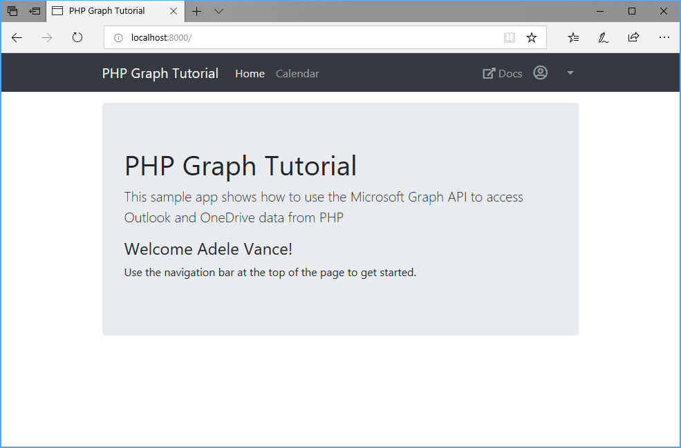
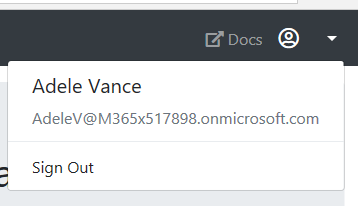

<!-- markdownlint-disable MD002 MD041 -->

Neste exercício, você estenderá o aplicativo do exercício anterior para oferecer suporte à autenticação com o Azure AD. Isso é necessário para obter o token de acesso OAuth necessário para chamar o Microsoft Graph. Nesta etapa, você integrará a biblioteca [oauth2-Client](https://github.com/thephpleague/oauth2-client) ao aplicativo.

Abra o `.env` arquivo na raiz do seu aplicativo PHP e adicione o código a seguir ao final do arquivo.

```text
OAUTH_APP_ID=YOUR_APP_ID_HERE
OAUTH_APP_PASSWORD=YOUR_APP_PASSWORD_HERE
OAUTH_REDIRECT_URI=http://localhost:8000/callback
OAUTH_SCOPES='openid profile offline_access user.read calendars.read'
OAUTH_AUTHORITY=https://login.microsoftonline.com/common
OAUTH_AUTHORIZE_ENDPOINT=/oauth2/v2.0/authorize
OAUTH_TOKEN_ENDPOINT=/oauth2/v2.0/token
```

Substitua `YOUR APP ID HERE` pela ID do aplicativo do portal de registro do aplicativo e substitua `YOUR APP SECRET HERE` pela senha gerada.

> [!IMPORTANT]
> Se você estiver usando o controle de origem como o Git, agora seria uma boa hora para excluir `.env` o arquivo do controle de origem para evitar vazar inadvertidamente sua ID de aplicativo e sua senha.

## <a name="implement-sign-in"></a>Implementar logon

Crie um novo arquivo no `./app/Http/Controllers` diretório chamado `AuthController.php` e adicione o código a seguir.

```PHP
<?php

namespace App\Http\Controllers;

use App\Http\Controllers\Controller;
use Illuminate\Http\Request;

class AuthController extends Controller
{
  public function signin()
  {
    // Initialize the OAuth client
    $oauthClient = new \League\OAuth2\Client\Provider\GenericProvider([
      'clientId'                => env('OAUTH_APP_ID'),
      'clientSecret'            => env('OAUTH_APP_PASSWORD'),
      'redirectUri'             => env('OAUTH_REDIRECT_URI'),
      'urlAuthorize'            => env('OAUTH_AUTHORITY').env('OAUTH_AUTHORIZE_ENDPOINT'),
      'urlAccessToken'          => env('OAUTH_AUTHORITY').env('OAUTH_TOKEN_ENDPOINT'),
      'urlResourceOwnerDetails' => '',
      'scopes'                  => env('OAUTH_SCOPES')
    ]);

    $authUrl = $oauthClient->getAuthorizationUrl();

    // Save client state so we can validate in callback
    session(['oauthState' => $oauthClient->getState()]);

    // Redirect to AAD signin page
    return redirect()->away($authUrl);
  }

  public function callback(Request $request)
  {
    // Validate state
    $expectedState = session('oauthState');
    $request->session()->forget('oauthState');
    $providedState = $request->query('state');

    if (!isset($expectedState) || !isset($providedState) || $expectedState != $providedState) {
      return redirect('/')
        ->with('error', 'Invalid auth state')
        ->with('errorDetail', 'The provided auth state did not match the expected value');
    }

    // Authorization code should be in the "code" query param
    $authCode = $request->query('code');
    if (isset($authCode)) {
      // Initialize the OAuth client
      $oauthClient = new \League\OAuth2\Client\Provider\GenericProvider([
        'clientId'                => env('OAUTH_APP_ID'),
        'clientSecret'            => env('OAUTH_APP_PASSWORD'),
        'redirectUri'             => env('OAUTH_REDIRECT_URI'),
        'urlAuthorize'            => env('OAUTH_AUTHORITY').env('OAUTH_AUTHORIZE_ENDPOINT'),
        'urlAccessToken'          => env('OAUTH_AUTHORITY').env('OAUTH_TOKEN_ENDPOINT'),
        'urlResourceOwnerDetails' => '',
        'scopes'                  => env('OAUTH_SCOPES')
      ]);

      try {
        // Make the token request
        $accessToken = $oauthClient->getAccessToken('authorization_code', [
          'code' => $authCode
        ]);

        // TEMPORARY FOR TESTING!
        return redirect('/')
          ->with('error', 'Access token received')
          ->with('errorDetail', $accessToken->getToken());
      }
      catch (League\OAuth2\Client\Provider\Exception\IdentityProviderException $e) {
        return redirect('/')
          ->with('error', 'Error requesting access token')
          ->with('errorDetail', $e->getMessage());
      }
    }

    return redirect('/')
      ->with('error', $request->query('error'))
      ->with('errorDetail', $request->query('error_description'));
  }
}
```

Isso define um controlador com duas ações: `signin` e `callback`.

A `signin` ação gera a URL de entrada do Azure AD, salva `state` o valor gerado pelo cliente OAuth e redireciona o navegador para a página de entrada do Azure AD.

A `callback` ação é onde o Azure redireciona após a conclusão da entrada. Essa ação garante que o `state` valor corresponde ao valor salvo e, em seguida, os usuários o código de autorização enviado pelo Azure para solicitar um token de acesso. Em seguida, ele redireciona de volta para a Home Page com o token de acesso no valor de erro temporário. Usaremos isso para verificar se a entrada está funcionando antes de prosseguir. Antes de testarmos, precisamos adicionar as rotas ao `./routes/web.php`.

```PHP
Route::get('/signin', 'AuthController@signin');
Route::get('/callback', 'AuthController@callback');
```

Inicie o servidor e navegue até `https://localhost:8000`. Clique no botão entrar e você deverá ser redirecionado para `https://login.microsoftonline.com`o. Faça logon com sua conta da Microsoft e concorde com as permissões solicitadas. O navegador redireciona para o aplicativo, mostrando o token.

### <a name="get-user-details"></a>Obter detalhes do usuário

Atualize o `callback` método no `/app/Http/Controllers/AuthController.php` para obter o perfil do usuário do Microsoft Graph.

Primeiro, adicione as seguintes `use` instruções à parte superior do arquivo, abaixo da `namespace App\Http\Controllers;` linha.

```php
use Microsoft\Graph\Graph;
use Microsoft\Graph\Model;
```

Substitua o `try` bloco no `callback` método pelo código a seguir.

```php
try {
  // Make the token request
  $accessToken = $oauthClient->getAccessToken('authorization_code', [
    'code' => $authCode
  ]);

  $graph = new Graph();
  $graph->setAccessToken($accessToken->getToken());

  $user = $graph->createRequest('GET', '/me')
    ->setReturnType(Model\User::class)
    ->execute();

  // TEMPORARY FOR TESTING!
  return redirect('/')
    ->with('error', 'Access token received')
    ->with('errorDetail', 'User:'.$user->getDisplayName().', Token:'.$accessToken->getToken());
}
```

O novo código cria um `Graph` objeto, atribui o token de acesso e, em seguida, usa-o para solicitar o perfil do usuário. Ele adiciona o nome de exibição do usuário à saída temporária para teste.

## <a name="storing-the-tokens"></a>Armazenar tokens

Agora que você pode obter tokens, é hora de implementar uma maneira de armazená-los no aplicativo. Como este é um aplicativo de exemplo, por questões de simplicidade, você os armazenará na sessão. Um aplicativo real usaria uma solução de armazenamento segura mais confiável, como um banco de dados.

Crie um novo diretório no `./app` diretório chamado `TokenStore`e, em seguida, crie um novo arquivo no diretório `TokenCache.php`chamado e adicione o código a seguir.

```php
<?php

namespace App\TokenStore;

class TokenCache {
  public function storeTokens($accessToken, $user) {
    session([
      'accessToken' => $accessToken->getToken(),
      'refreshToken' => $accessToken->getRefreshToken(),
      'tokenExpires' => $accessToken->getExpires(),
      'userName' => $user->getDisplayName(),
      'userEmail' => null !== $user->getMail() ? $user->getMail() : $user->getUserPrincipalName()
    ]);
  }

  public function clearTokens() {
    session()->forget('accessToken');
    session()->forget('refreshToken');
    session()->forget('tokenExpires');
    session()->forget('userName');
    session()->forget('userEmail');
  }

  public function getAccessToken() {
    // Check if tokens exist
    if (empty(session('accessToken')) ||
        empty(session('refreshToken')) ||
        empty(session('tokenExpires'))) {
      return '';
    }

    return session('accessToken');
  }
}
```

Em seguida, atualize `callback` a função na `AuthController` classe para armazenar os tokens na sessão e redirecionar de volta para a página principal.

Primeiro, adicione a seguinte `use` instrução à parte superior de `./app/Http/Controllers/AuthController.php`, abaixo da `namespace App\Http\Controllers;` linha.

```php
use App\TokenStore\TokenCache;
```

Em seguida, `try` substitua o bloco na `callback` função existente pelo seguinte.

```php
try {
  // Make the token request
  $accessToken = $oauthClient->getAccessToken('authorization_code', [
    'code' => $authCode
  ]);

  $graph = new Graph();
  $graph->setAccessToken($accessToken->getToken());

  $user = $graph->createRequest('GET', '/me')
    ->setReturnType(Model\User::class)
    ->execute();

  $tokenCache = new TokenCache();
  $tokenCache->storeTokens($accessToken, $user);

  return redirect('/');
}
```

## <a name="implement-sign-out"></a>Implementar a saída

Antes de testar esse novo recurso, adicione uma maneira de sair. Adicione a ação a seguir à `AuthController` classe.

```PHP
public function signout()
{
  $tokenCache = new TokenCache();
  $tokenCache->clearTokens();
  return redirect('/');
}
```

Adicione esta ação a `./routes/web.php`.

```PHP
Route::get('/signout', 'AuthController@signout');
```

Reinicie o servidor e vá pelo processo de entrada. Você deve terminar de volta na Home Page, mas a interface do usuário deve ser alterada para indicar que você está conectado.



Clique no avatar do usuário no canto superior direito para acessar o **** link sair. Clicar **** em sair redefine a sessão e retorna à Home Page.



## <a name="refreshing-tokens"></a>Atualizando tokens

Nesse ponto, seu aplicativo tem um token de acesso, que é enviado no `Authorization` cabeçalho das chamadas de API. Este é o token que permite que o aplicativo acesse o Microsoft Graph em nome do usuário.

No entanto, esse token é de vida curta. O token expira uma hora após sua emissão. É onde o token de atualização se torna útil. O token de atualização permite que o aplicativo solicite um novo token de acesso sem exigir que o usuário entre novamente. Atualize o código de gerenciamento de token para implementar a atualização de token.

Abra `./app/TokenStore/TokenCache.php` e adicione a função a seguir à `TokenCache` classe.

```php
public function updateTokens($accessToken) {
  session([
    'accessToken' => $accessToken->getToken(),
    'refreshToken' => $accessToken->getRefreshToken(),
    'tokenExpires' => $accessToken->getExpires()
  ]);
}
```

Em seguida, substitua `getAccessToken` a função existente pelo seguinte.

```php
public function getAccessToken() {
  // Check if tokens exist
  if (empty(session('accessToken')) ||
      empty(session('refreshToken')) ||
      empty(session('tokenExpires'))) {
    return '';
  }

  // Check if token is expired
  //Get current time + 5 minutes (to allow for time differences)
  $now = time() + 300;
  if (session('tokenExpires') <= $now) {
    // Token is expired (or very close to it)
    // so let's refresh

    // Initialize the OAuth client
    $oauthClient = new \League\OAuth2\Client\Provider\GenericProvider([
      'clientId'                => env('OAUTH_APP_ID'),
      'clientSecret'            => env('OAUTH_APP_PASSWORD'),
      'redirectUri'             => env('OAUTH_REDIRECT_URI'),
      'urlAuthorize'            => env('OAUTH_AUTHORITY').env('OAUTH_AUTHORIZE_ENDPOINT'),
      'urlAccessToken'          => env('OAUTH_AUTHORITY').env('OAUTH_TOKEN_ENDPOINT'),
      'urlResourceOwnerDetails' => '',
      'scopes'                  => env('OAUTH_SCOPES')
    ]);

    try {
      $newToken = $oauthClient->getAccessToken('refresh_token', [
        'refresh_token' => session('refreshToken')
      ]);

      // Store the new values
      $this->updateTokens($newToken);

      return $newToken->getToken();
    }
    catch (League\OAuth2\Client\Provider\Exception\IdentityProviderException $e) {
      return '';
    }
  }

  // Token is still valid, just return it
  return session('accessToken');
}
```

Este método primeiro verifica se o token de acesso expirou ou está prestes a expirar. Se for, ele usará o token de atualização para obter novos tokens, atualizará o cache e retornará o novo token de acesso.