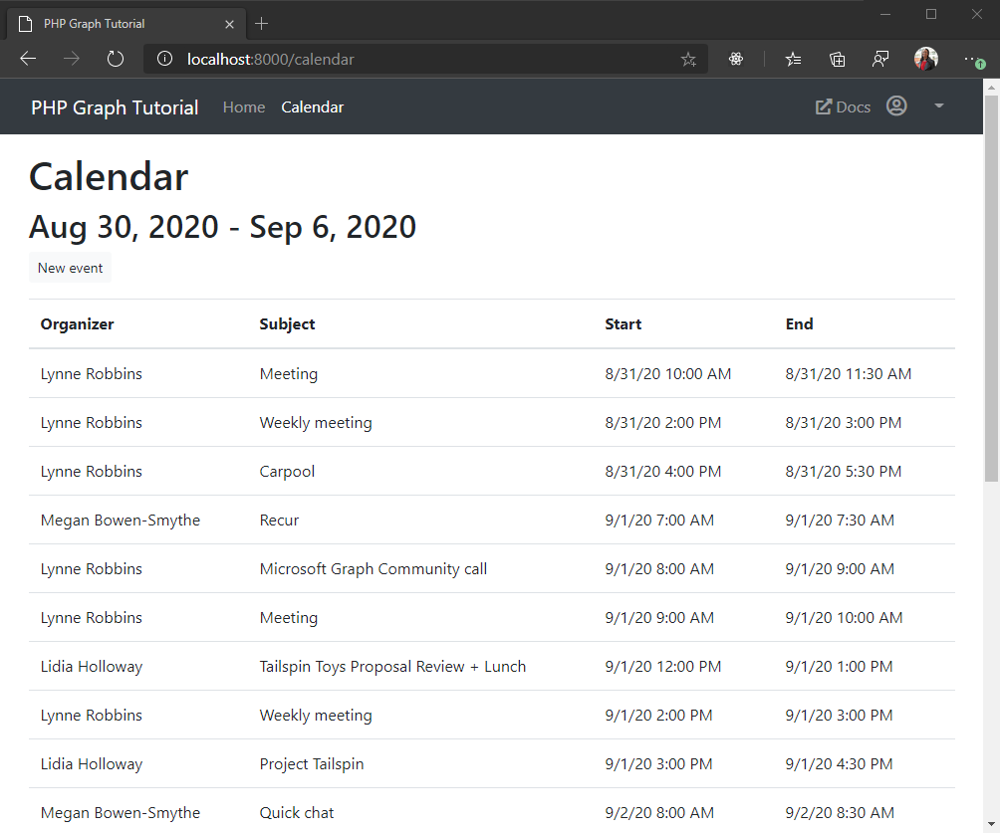

<!-- markdownlint-disable MD002 MD041 -->

Neste exercício, você incorporará o Microsoft Graph no aplicativo. Para este aplicativo, você usará a biblioteca do [Microsoft-Graph](https://github.com/microsoftgraph/msgraph-sdk-php) para fazer chamadas para o Microsoft Graph.

## <a name="get-calendar-events-from-outlook"></a>Obter eventos de calendário do Outlook

Vamos começar adicionando um controlador para o modo de exibição calendário. Crie um novo arquivo na `./app/Http/Controllers` pasta nomeada `CalendarController.php`e adicione o código a seguir.

```php
<?php

namespace App\Http\Controllers;

use App\Http\Controllers\Controller;
use Illuminate\Http\Request;
use Microsoft\Graph\Graph;
use Microsoft\Graph\Model;
use App\TokenStore\TokenCache;

class CalendarController extends Controller
{
  public function calendar()
  {
    $viewData = $this->loadViewData();

    // Get the access token from the cache
    $tokenCache = new TokenCache();
    $accessToken = $tokenCache->getAccessToken();

    // Create a Graph client
    $graph = new Graph();
    $graph->setAccessToken($accessToken);

    $queryParams = array(
      '$select' => 'subject,organizer,start,end',
      '$orderby' => 'createdDateTime DESC'
    );

    // Append query parameters to the '/me/events' url
    $getEventsUrl = '/me/events?'.http_build_query($queryParams);

    $events = $graph->createRequest('GET', $getEventsUrl)
      ->setReturnType(Model\Event::class)
      ->execute();

    return response()->json($events);
  }
}
```

Considere o que esse código está fazendo.

- A URL que será chamada é `/v1.0/me/events`.
- O `$select` parâmetro limita os campos retornados para cada evento para apenas aqueles que o modo de exibição realmente usará.
- O `$orderby` parâmetro classifica os resultados pela data e hora em que foram criados, com o item mais recente em primeiro lugar.

Atualizar as rotas em `./routes/web.php` para adicionar uma rota a este novo controlador

```php
Route::get('/calendar', 'CalendarController@calendar');
```

Agora você pode testar isso. Entre e clique no link **calendário** na barra de navegação. Se tudo funcionar, você deverá ver um despejo JSON de eventos no calendário do usuário.

## <a name="display-the-results"></a>Exibir os resultados

Agora você pode adicionar um modo de exibição para exibir os resultados de forma mais amigável. Crie um novo arquivo no `./resources/views` diretório chamado `calendar.blade.php` e adicione o código a seguir.

```php
@extends('layout')

@section('content')
<h1>Calendar</h1>
<table class="table">
  <thead>
    <tr>
      <th scope="col">Organizer</th>
      <th scope="col">Subject</th>
      <th scope="col">Start</th>
      <th scope="col">End</th>
    </tr>
  </thead>
  <tbody>
    @isset($events)
      @foreach($events as $event)
        <tr>
          <td>{{ $event->getOrganizer()->getEmailAddress()->getName() }}</td>
          <td>{{ $event->getSubject() }}</td>
          <td>{{ \Carbon\Carbon::parse($event->getStart()->getDateTime())->format('n/j/y g:i A') }}</td>
          <td>{{ \Carbon\Carbon::parse($event->getEnd()->getDateTime())->format('n/j/y g:i A') }}</td>
        </tr>
      @endforeach
    @endif
  </tbody>
</table>
@endsection
```

Isso executará um loop através de uma coleção de eventos e adicionará uma linha de tabela para cada um. Remova a `return response()->json($events);` linha da `calendar` ação no `./app/Http/Controllers/CalendarController.php`e substitua-a pelo código a seguir.

```php
$viewData['events'] = $events;
return view('calendar', $viewData);
```

Atualize a página e o aplicativo agora deve renderizar uma tabela de eventos.

